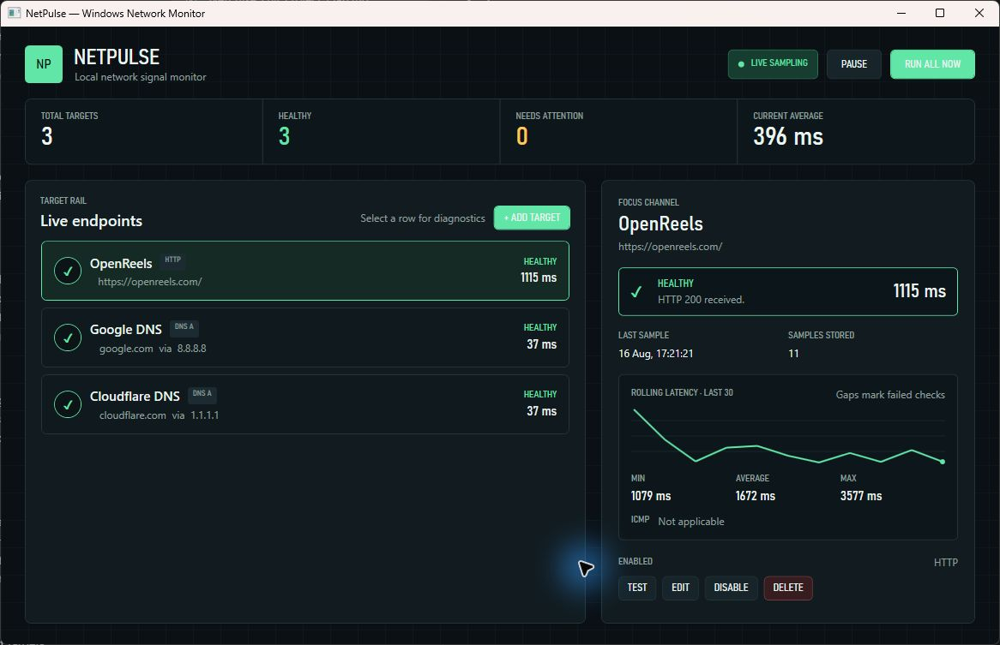

# NetPulse

NetPulse is a compact Windows network-health dashboard built with C# and WPF. It monitors HTTP endpoints and explicit DNS resolvers, presents real latency and accessible health states, and keeps a short local history without accounts, telemetry, or a cloud service.



## What it does

- Checks HTTP and HTTPS endpoints with cancellation, hard timeouts, redirects, and status-aware health mapping.
- Sends A-record queries through the DNS resolver you specify; DNS caching and automatic retries are disabled.
- Shows ICMP reachability as a separate DNS-target signal without allowing it to override a successful DNS result.
- Runs one sequential loop per target and prevents a scheduled check from overlapping a manual test.
- Stores at most 100 results per target and graphs the latest 30 successful latencies with gaps for failures.
- Seeds three removable first-run examples: OpenReels, Google DNS, and Cloudflare DNS.
- Installs per machine through a WiX MSI while retaining user-owned settings after removal.

## Health model

| State | Meaning |
|---|---|
| Healthy | HTTP 2xx/3xx, or a DNS A response containing at least one address |
| Degraded | HTTP 4xx/5xx, or a DNS resolver response such as NXDOMAIN |
| Offline | Timeout, name resolution, socket, connection, or TLS transport failure |
| Error | Invalid target configuration or an unexpected internal failure |

Every state uses text and an icon as well as colour.

## Install

NetPulse 1.0.0 targets Windows x64 and requires the [Microsoft .NET Desktop Runtime 10 x64](docs/runtime-prerequisite.md). Download `NetPulseSetup.msi` and `NetPulseSetup.sha256` from the [latest GitHub release](https://github.com/MudabbirulSaad/NetPulse/releases/latest), compare the checksum, then run the MSI as an administrator.

The installed application lives under `%ProgramFiles%\NetPulse`. Settings, history, and logs live under `%LocalAppData%\NetPulse` and remain after uninstallation. See the [deployment checks](docs/deployment-testing.md) and [retention policy](docs/user-data-retention.md) for the exact behavior.

## Use

1. Start NetPulse from the Start menu.
2. Select a target to inspect its latest result, latency history, min/average/max values, and optional ICMP signal.
3. Choose **Add target** for an HTTP URL or a DNS domain/resolver pair.
4. Use **Test** for an immediate check, **Edit** to change timing or endpoint details, and **Disable** to pause one target without deleting it.
5. Use **Pause** to stop recurring sampling or **Run all now** for one immediate pass.

Target names are 1–60 characters. HTTP targets accept absolute `http` or `https` URLs. DNS targets accept an internationalized domain name and an IPv4 or IPv6 resolver address. Polling can be 5, 10, 30, or 60 seconds; timeout must be 1–30 seconds and shorter than the polling interval. The dashboard accepts at most 25 targets.

More detail is available in the [usage guide](docs/usage.md) and [common-problems guide](docs/troubleshooting/common-problems.md).

## Build and test

Prerequisites:

- Windows 10/11 x64
- .NET SDK 10.0.400 selected by `global.json`
- Visual Studio 2026 with the .NET desktop development workload, or the .NET CLI
- HeatWave Community Edition when working with the installer inside Visual Studio

```powershell
dotnet tool restore
dotnet restore NetPulse.sln -p:Platform=x64
dotnet build NetPulse.sln -c Release --no-restore -p:Platform=x64
dotnet test NetPulse.sln -c Release --no-build --no-restore -p:Platform=x64
```

The deterministic suite contains 104 tests across core, infrastructure, and WPF view-model behavior. Real-network checks are opt-in with `NETPULSE_RUN_NETWORK_TESTS=1` and do not run in ordinary CI.

Build and inspect the MSI:

```powershell
dotnet build installer\NetPulse.Setup\NetPulse.Setup.wixproj -c Release -p:Platform=x64
pwsh -NoProfile -File scripts\installer\Test-NetPulsePackage.ps1
```

The [Windows workflow](.github/workflows/windows.yml) builds, tests, publishes, packages, inspects, hashes, and uploads the release artifacts. Dependabot tracks NuGet and workflow dependencies.

## Architecture

The WPF application depends on one app-facing module, `INetPulseSession`. The core owns target rules, immutable state, scheduling, and metrics; infrastructure owns HTTP, DNS, ICMP, JSON, and logging adapters. This keeps the UI unaware of network libraries and storage details.

- [Architecture map](docs/architecture/architecture.md)
- [Domain model](docs/architecture/domain-model.md)
- [Monitoring session](docs/architecture/monitoring-session.md)
- [Dependency inventory](docs/dependency-inventory.md)
- [Architecture decisions](docs/architecture/adr-001-platform-and-packaging.md)

## Data and privacy

NetPulse makes only the network requests configured in the target list. It does not transmit analytics, create user accounts, or send settings/history/logs elsewhere. Logs exclude target names, URLs, resolver domains, query strings, credentials, and exception messages. See the complete [privacy statement](docs/privacy.md).

`https://openreels.app` is only a low-frequency public demonstration target. NetPulse does not import, modify, deploy, or require access to OpenReels source code, credentials, databases, APIs, DNS records, or infrastructure.

## Scope

Version 1.0 deliberately omits tray mode, alerts, TLS certificate monitoring, authentication, a cloud backend, and other expansion features. The goal is a reliable, explainable desktop utility.

## Project records

- [Delivery plan](docs/project-plan.md)
- [Definition of Done](docs/definition-of-done.md)
- [Assessment evidence index](docs/evidence/assessment-index.md)
- [Task 1 submission report](docs/task1-submission-report.md)
- [WinGet distribution record](docs/distribution/winget.md)
- [License](LICENSE) — MIT
