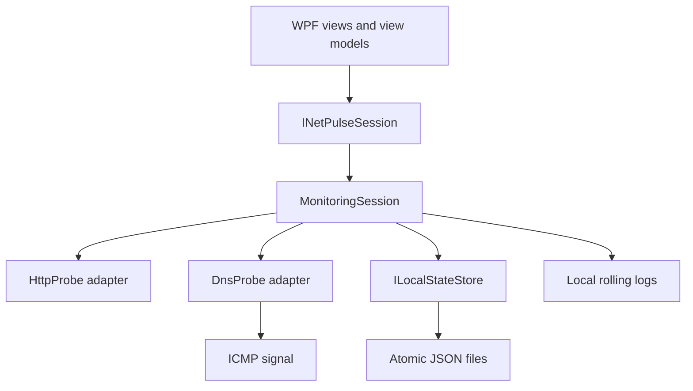

# Architecture



## Module responsibilities

### NetPulse.App

Owns WPF views, view models, commands, dialogs, UI-thread dispatching, and application lifetime. It calls only the `INetPulseSession` interface for monitoring and target changes.

### NetPulse.Core

Owns target/result types, validation, health classification, rolling metrics, the session interface, and monitoring orchestration. It has no WPF, DNS-library, file-system, or logging-package dependency.

### NetPulse.Infrastructure

Provides HTTP, explicit DNS, ICMP, JSON persistence, and logging adapters. External failures are translated into core result types rather than escaping into the UI.

## Dependency direction

```text
NetPulse.App ────────────────┐
    │                        │
    ├──> NetPulse.Core <─────┤
    │                        │
    └──> NetPulse.Infrastructure
                 │
                 └──> NetPulse.Core
```

`NetPulse.Core` has no reference to WPF, DnsClient, Serilog, or the file system. The app references infrastructure only in its composition root; views and view models operate through `INetPulseSession`. Probe and storage adapters remain behind internal seams.

## Data flow

1. A view model submits a validated `TargetChange` or one-off test request.
2. `MonitoringSession` applies the target set and owns one sequential loop per enabled target.
3. The matching probe adapter returns a typed `CheckResult`.
4. The session updates rolling history and metrics, persists state, and raises one state-change event.
5. The view model marshals the immutable snapshot onto the WPF dispatcher.

## Reliability rules

- Per-target exclusion prevents scheduled and one-off checks from overlapping.
- Cancellation during shutdown does not publish a false failure.
- Target failures are isolated from other loops.
- Files use temporary-write plus replace semantics.
- ICMP is informational and never overrides a successful DNS response.

## State ownership

`MonitoringSession` is the single writer for configured targets and history. Consumers receive immutable `NetPulseState` snapshots through `CurrentState` and `StateChanged`. Each target has one scheduling task and one lock shared with one-off checks. A target change cancels and replaces only the affected loop.

The JSON store owns serialization and atomic replacement but does not decide monitoring behavior. The WPF dispatcher owns UI-thread projection but does not perform network or disk work.

## Runtime composition

At startup the WPF composition root creates one long-lived HTTP client, DNS and ICMP adapters, the JSON state store, the monitoring session, and the file logger. Application close cancels the session, waits for its loops, disposes the composition root, flushes logging, and explicitly exits the dispatcher.
